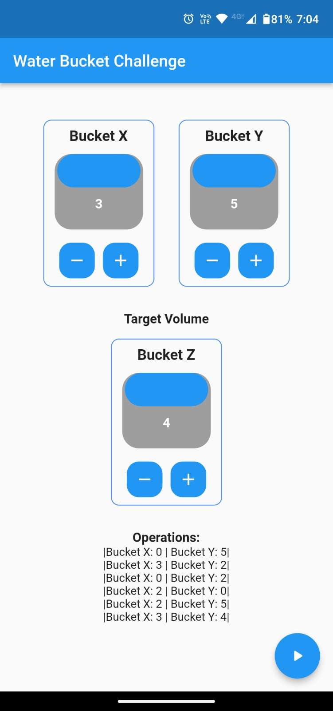
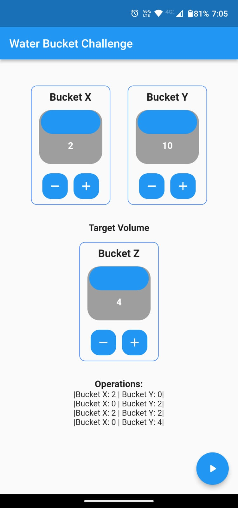
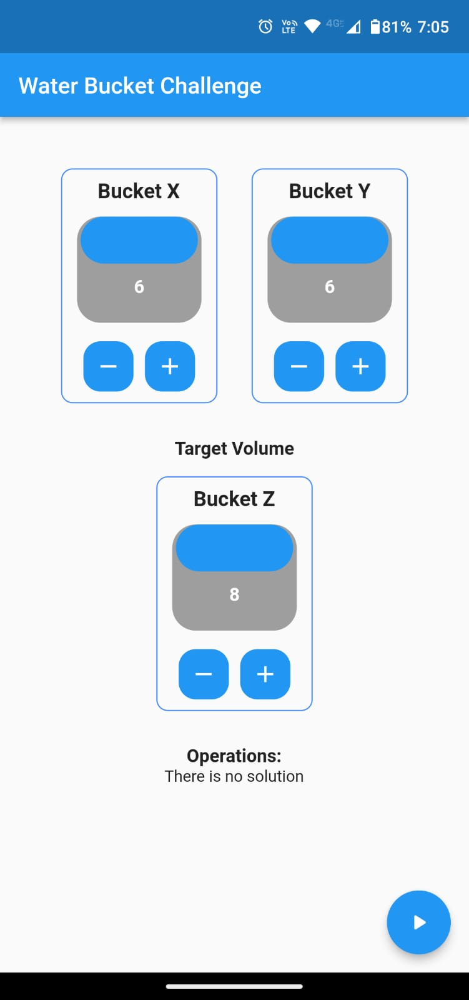

# Water Bucket Challenge App Test

This is a Flutter App test of the **Water Bucket Challenge**.

## OVERVIEW

Build an application that solves the Water Jug Riddle for dynamic inputs (X, Y, Z). The
simulation should have a UI to display state changes for each state for each jug (Empty, Full or
Partially Full).
You have an X-gallon and a Y-gallon jug that you can fill from a lake. (Assume lake has unlimited amount
of water.) By using only an X-gallon and Y-gallon jug (no third jug), measure Z gallons of water.

GOALS
1. Measure Z gallons of water in the most efficient way.
2. Build a UI where a user can enter any input for X, Y, Z and see the solution.
3. If no solution, display “No Solution”.
   
LIMITATIONS
• Actions allowed: Fill, Empty, Transfer.

### Example:

    Bucket x: 2

    Bucket Y: 10

    Amount wanted Z: 4


### This is the best solution:

    Bucket x Bucket y Explanation

        2       0      Fill bucket x

        0       2      Transfer bucket x to bucket y

        2       2      Fill bucket x

        0       4      Transfer bucket x to bucket y.

    Solved


### Worst Solution

    Bucket x Bucket y Explanation

        0       10     Fill bucket y

        2       8      Transfer bucket y to bucket x

        0       8      Dump bucket x

        2       6      Transfer bucket y to bucket x

        0       6      Dumb bucket x

        2       4      Transfer bucket y to bucket x.

    Solved


## Getting Started

If you want to try this project and its Flutter application you need to have previously installed the Flutter SDK and all the configurations needed for the development environment.

A few resources to get you started if this is your first Flutter project:

[How to install Flutter](https://docs.flutter.dev/get-started/install)

For help getting started with Flutter, view the
[online documentation](https://flutter.dev/docs), which offers tutorials,
samples, guidance on mobile development, and a full API reference.

Then you have to be at the root of the project and enter the command:

```console
flutter run
```

## Examples
### Input with solution




### Input without solution

